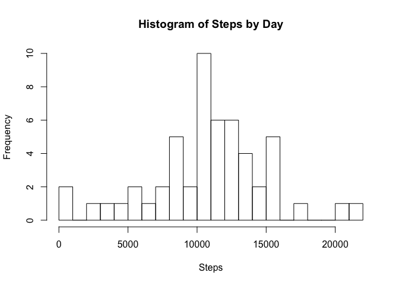

# Reproducible Research: Peer Assessment 1

#Load required packages

```r
library(ggplot2)
```

```
## Warning: package 'ggplot2' was built under R version 3.1.3
```

## Loading and preprocessing the data


```r
unzip_file <- unzip("/Users/hhvandi/Desktop/Coursera Data Science Specialization/Reproducible Research/Project 1/repdata-data-activity.zip", unzip="internal")
my_data <- read.table(unzip_file, header=T, sep=",")
```

## What is mean total number of steps taken per day?

```r
my_data$date <-as.Date(my_data$date)
steps_by_day <- aggregate(my_data$steps, by= list(my_data$date), FUN="sum", na.rm=F)
hist(steps_by_day$x, breaks=30, freq=T, main= "Histogram of Steps by Day", xlab="Steps")
```

 

```r
mean(steps_by_day$x[!is.na(steps_by_day$x)])
```

```
## [1] 10766.19
```

```r
median(steps_by_day$x[!is.na(steps_by_day$x)])
```

```
## [1] 10765
```

```r
## What is the average daily activity pattern?
```

```r
steps_by_interval <- aggregate(my_data$steps, by= list(my_data$interval), FUN="mean", na.rm=T)
plot(steps_by_interval, type="l", main="Average Daily Activity Pattern",xlab= "5-min Interval", ylab="Average")
```

 

```r
max(steps_by_interval$x)
```

```
## [1] 206.1698
```

```r
steps_by_interval$Group.1[which.max(steps_by_interval$x)]
```

```
## [1] 835
```

## Imputing missing values


```r
sum(is.na(my_data))
```

```
## [1] 2304
```

```r
my_data1 <- my_data
for (row in 1:length(my_data1$steps)) {
  if(is.na(my_data1[row,1])){
    my_data1[row,1]=steps_by_interval[steps_by_interval$Group.1==my_data1[row,3],2]
  }
}
steps_by_day1 <- aggregate(my_data1$steps, by= list(my_data1$date), FUN="sum", na.rm=F)
hist(steps_by_day1$x, breaks=30, freq=T, main= "Histogram of Steps by Day", xlab="Steps")
```

 

```r
mean(steps_by_day1$x[!is.na(steps_by_day1$x)])
```

```
## [1] 10766.19
```

```r
median(steps_by_day1$x[!is.na(steps_by_day1$x)])
```

```
## [1] 10766.19
```

## Are there differences in activity patterns between weekdays and weekends?

```r
my_data1$day <- weekdays(my_data1$date)
my_data1$type <- ifelse(my_data1$day=="Saturday"|my_data1$day=="Sunday","Weekend","Weekday")
my_data1$type <- as.factor(my_data1$type)
my_data1$interval=as.factor(my_data1$interval)
steps_by_week_weekend <- aggregate(my_data1$steps, list(as.factor(my_data1$interval), as.factor(my_data1$type)),mean)
panel_plot <- ggplot(steps_by_week_weekend, aes(x = as.integer(Group.1), y=x)) + geom_line()
panel_plot + facet_grid(Group.2~.)+xlab("Interval")+ylab("Average Interval Steps")
```

 
